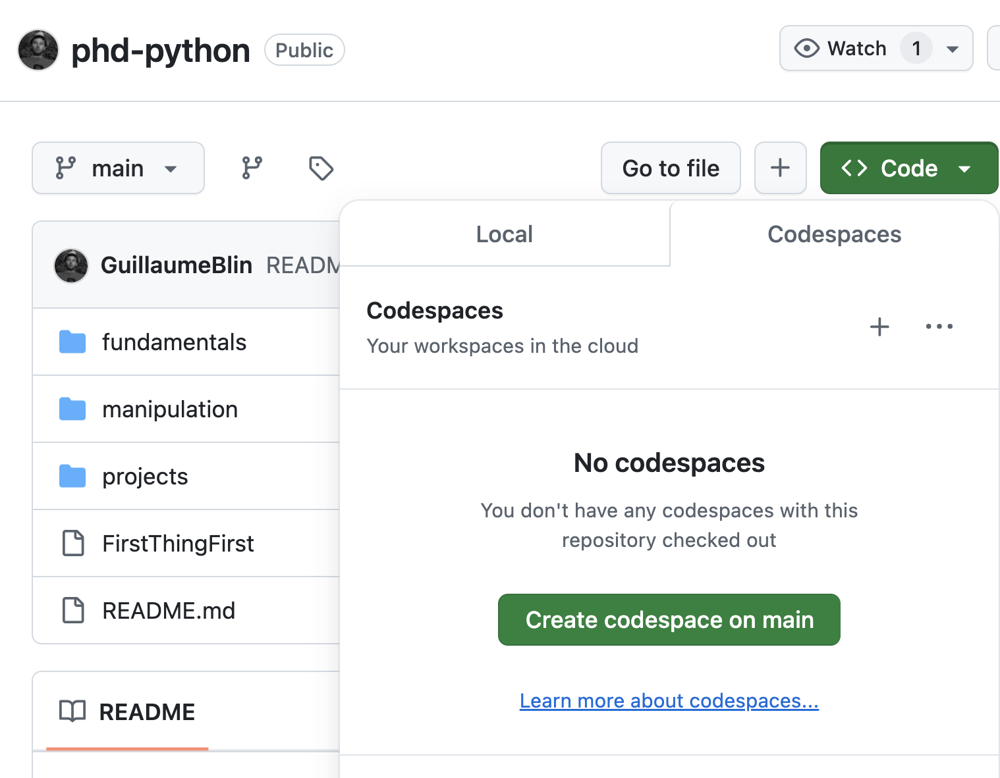

* Afin de suivre ce tutoriel, vous devez d'abord vous [créer un compte sur GitHub](https://github.com/signup). 
* Une fois enregistré, [connectez-vous](https://github.com/login) et [accéder à ce dépôt](https://github.com/GuillaumeBlin/phd-python) puis allez dans <button style="background-color: #04AA6D;border-radius: 8px;;color:white;padding:8px"><> Code </button> / <button style="background-color: lightgrey;border-radius: 8px;padding:8px">Codespaces</button> / <button style="background-color: #04AA6D;border-radius: 8px;color:white;padding:8px">Create codespace on main</button>

* Vous devriez maintenant être en mesure d'exécuter les notebooks dans une version en ligne de Visual Studio Code.

* Vous aurez un environnement complet dans lequel vous pourrez exécuter les codes Python.

